# Computer-Basics

## Index

1. [Basic logic gates (`AND`, `NOT`)](#section_1)
2. [Compound logic gates (`NAND`, `OR`, `XOR`)](#section_2)
3. [Binary addition](#section_3)
4. [Binary subtraction](#section_4)

In this project I go through the basics of computer operations.

### 1. Basic logic gates (`AND`, `NOT`)

The `AND` and `NOT` logic gates, which can be easily created with simple circuits, are the basis for the rest of the elements addressed in this project.

`AND`

  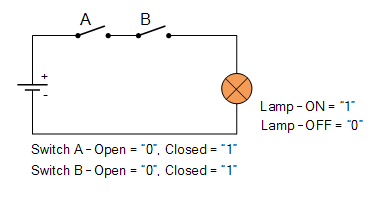
  

`NOT`

  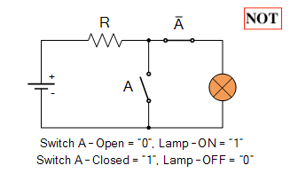
  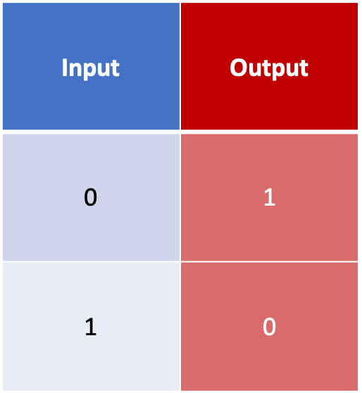

### 2. Compound logic gates (`NAND`, `OR`, `XOR`)

- `NAND` -> consists of an `AND` gate followed by a `NOT` gate.
- `OR` -> each input is passed through a `NOT` gate, and then both of them enter a `NAND` gate.
- `XOR` -> an `OR` gate and a `NAND` gate both receive both inputs in parallel. The output of these two gates enter an `AND` gate.

`NAND`

  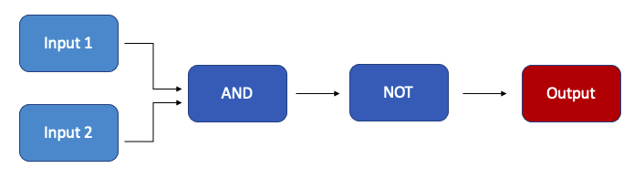
  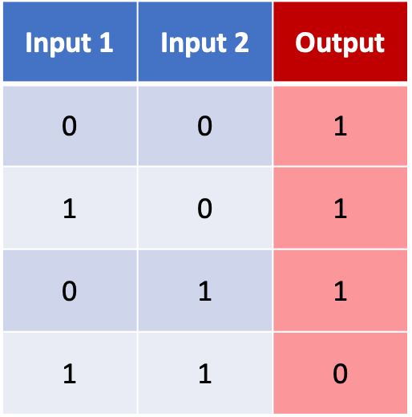

`OR`

  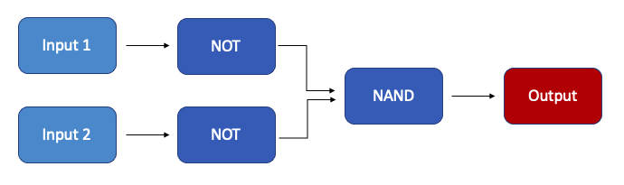
  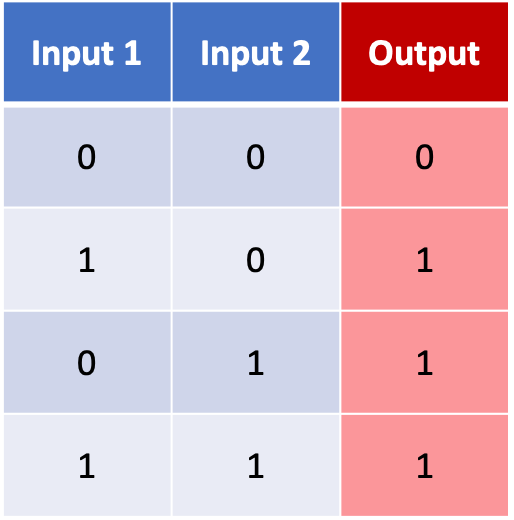

`XOR`

  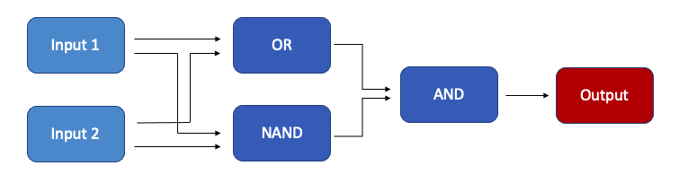
  

### 3. Binary addition

<strong>Addition of 1-bit numbers</strong>

The following diagram represents the binary sum of 2 bits (A and B). It is clear that the carry column matches perfectly the `AND` gate, and the sum column matches the `XOR` gate.

  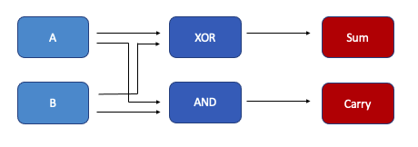
  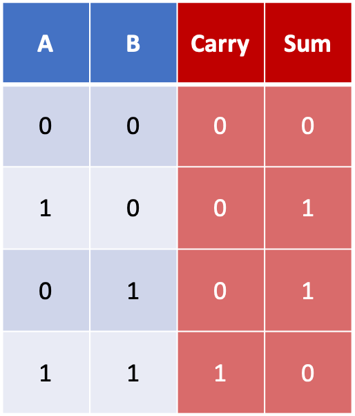

However, we have to add a third input to the addition in order to take into account the carry bit and construct our adder.

  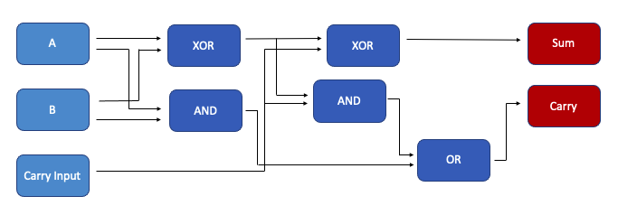
  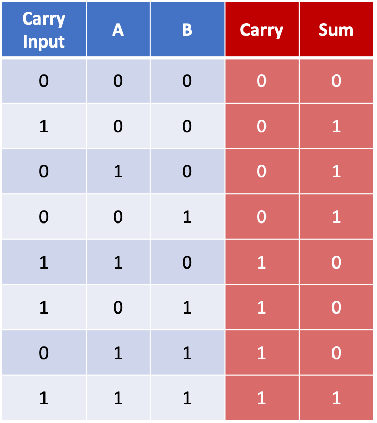

<small>
   
</small>

<strong>Addition of 4-bit numbers</strong>

With the adder we previously created, we can easily generate a 4-bit numbers adder. This adder overflows when the sum is greater than 4 bits, and this is indicated by the carry output.

  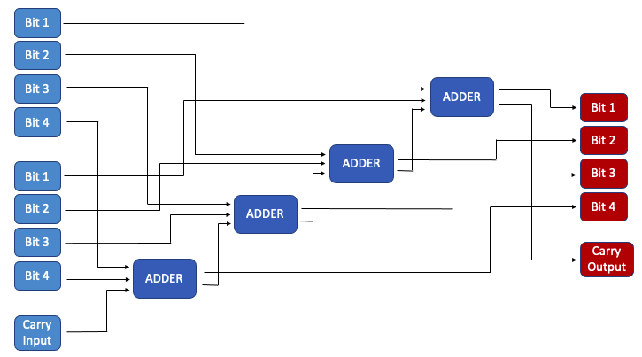

<small>
   
</small>

<strong>General addition</strong>

With this simple adder, we can create a general adder for any two numbers (function `general_adder` in `binary_addition.py`).

### 4. Binary subtraction

The first step we have to take in order to create the subtraction is to generate binary negative numbers.

<strong>Binary negative numbers</strong>

We are going to use the **"Two's complement"** approach to represent negative numbers in binary. This can be done just by following some steps:

1. Take the binary representation of the positive value (this is, to construct -8, take 8 in binary -> 1000).
2. Add one extra 0 bit at the beginning (1000 -> 01000)
3. Invert every bit (01000 -> 10111).
4. Add 1 to that number (10111 + 00001 = 11000).

This process can be achieved using the `NOT` gate and the `general_adder` we created before, as shown in the following diagram.

  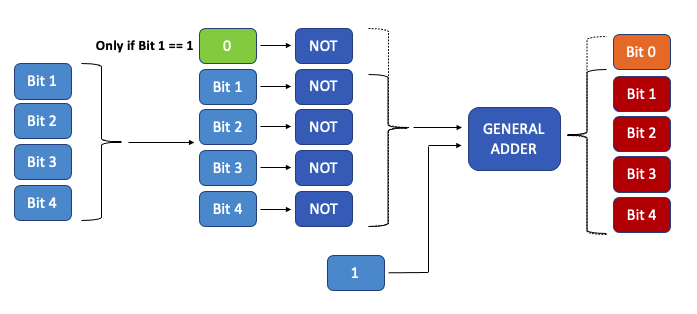

