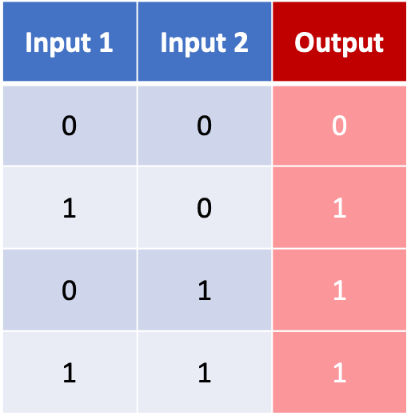

# Computer-Basics

## Index

1. [Basic logic gates (AND, NOT)](#section_1)
2. [Compound logic gates (NAND, OR, XOR)](#section_2)
3. [Binary adder](#section_3)

Exploring computer basics.

In this project I go through the basics of computer operations.

### 1. Basic logic gates (AND, NOT)

The AND and NOT logic gates, which can be easily created with simple circuits, are the basis for the rest of the elements addressed in this project.

<strong>AND</strong>

  
  

<strong>NOT</strong>

  
  

### 2. Compound logic gates (NAND, OR, XOR)

- NAND -> consists of an AND gate followed by a NOT gate.
- OR -> each input is passed through a NOT gate, and then both of them enter a NAND gate.
- XOR -> an OR gate and a NAND gate both receive both inputs in parallel. The output of these two gates enter an AND gate.

<strong>NAND</strong>

  
  

<strong>OR</strong>

  
  

<strong>XOR</strong>

  
  

### 3. Binary adder

<strong>2-bits addition</strong>

The following diagram represents the binary sum of 2 bits (A and B). It is clear that the carry column matches perfectly the AND gate, and the sum column matches the XOR gate.

  
  

<small>
    
</small>
  

<strong>3-bits addition</strong>

In order to consider the carry bit, we have to add a third input to the addition.

  
  

