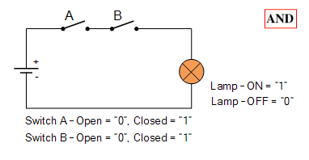

# Computer-Basics

Exploring computer basics.

In this project I go through the basics of computer operations.

Starting from the basic AND and NOT logic gates, which can be easily created with the circuits, 

  

  

